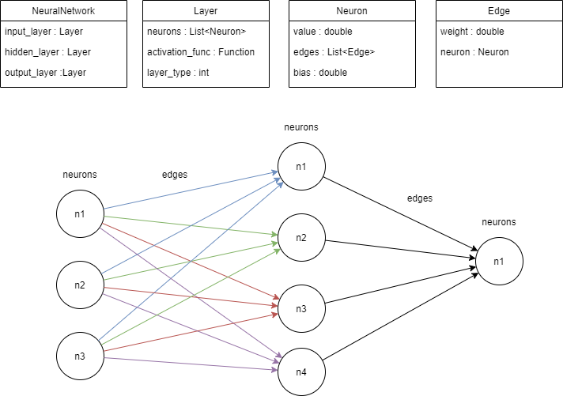

# Rede Neural em C
Repositório destinado a implementação de uma Rede Neural Perceptron Multicamadas alimentada com pesos e bias resultantes de treinamento em ambiente externo. A intenção do desenvolvimento deste projeto é possibilitar a implementação de uma rede neural treinada em um sistema embarcado.

## Compilação e execução
Para compilar os arquivos basta executar o comando abaixo:
```
make
```
Para visualizar um exemplo, basta executar:
```
./neural
```
## Estrutura
Foi implementada a rede neural utilizando a seguinte estrutura:

<div align="center">
  
</div>
</br>

Cada "objeto" representado pela imagem acima está implementado no formato de TAD (Tipo Abstrato de Dados). É possível consultar a utilidade e as funções de cada TAD em seu respectivo arquivo ```.h```. Já nos arquivos ```.c``` estão as implementações das funções descritas nos arquivos ```.h```.

Para atualizar os pesos da rede neural basta editar os arquivos: 
```h_weights.txt``` (pesos da camada oculta) e ```o_weights.txt``` (pesos da camada de saída).

Para atualizar os bias da rede neural basta editar os arquivos: 
```h_bias.txt``` (bias da camada oculta) e ```o_bias.txt``` (bias da camada de saída)
